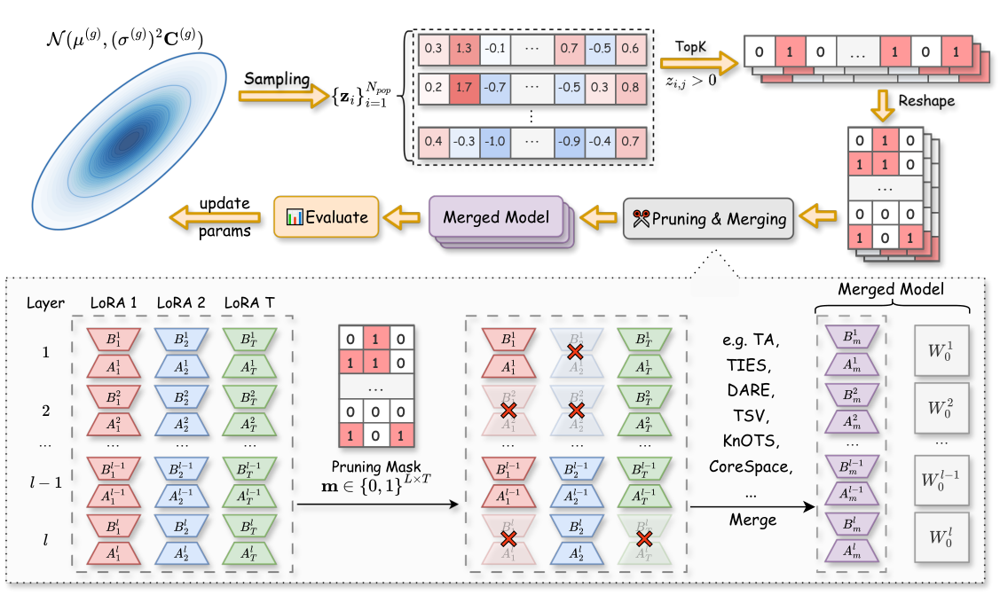

# Evolutionary Negative Module Pruning for Better LoRA Merging

> ACL 2026 Main | [Paper](#) | [Citation](#citation)

**ENMP** (Evolutionary Negative Module Pruning) is a LoRA pruning method designed to locate and exclude `negative modules` prior to merging, consistently improving the performance of existing merging algorithms (e.g., TV, TIES, DARE, TSV, KnOTS, CoreSpace) across both language and vision domains.




---

## Setup

```bash
conda env create -f environment.yml
conda activate enmp
```

---

## Datasets & Checkpoints

### LoRA Checkpoints

We use the LoRA checkpoints released by [KnOTS](https://github.com/gstoica27/KnOTS).

### Datasets

Standard datasets are fetched automatically via `torchvision` or `huggingface` on first use. A few datasets (Cars, DTD, EuroSAT, SUN397) require manual setup — see this [issue](https://github.com/mlfoundations/task_vectors/issues/1) for step-by-step instructions.


## Usage

### Run ENMP evolutionary search

```bash
python enmp_train.py \
    --config vitB_r16_full_ties.py \
    --seed 42 \
    --topk 0.2 \
    --sigma0 0.5 \
    --popsize 8 \
    --maxiter 30 \
    --num_gpus 8
```

Key arguments:

| Argument | Default | Description |
|---|---|---|
| `--config` | `vitB_r16_full_ties.py` | Config file in `configs/` |
| `--topk` | `0.2` | Fraction of modules to prune |
| `--sigma0` | `0.5` | CMA-ES initial step size |
| `--popsize` | `8` | CMA-ES population size |
| `--maxiter` | `30` | CMA-ES iterations |
| `--addscale` | flag | Also optimize scaling coefficients |
| `--num_gpus` | auto | Number of GPUs for parallel evaluation |

Results are logged to `EXP_LOG/enmp_log_<timestamp>.print`.

### Evaluate with a specific mask

```bash
# Vision
python test_vision.py --config vitB_r16_full_ties.py --mask "[0, 3, 7, 12]"

# NLI
python test_nli.py --config llama8B_r16_ties.py --mask "[1, 5, 9]"
```

The `--mask` argument is a list of (flattened) module indices to **prune** during merging.

---

## Supported Merging Methods

| Method | `merge_method` | `merge_space` |
|---|---|---|
| Task Vector | `tv` | `full` / `knots` / `core` |
| TIES | `ties` | `full` / `knots` / `core` |
| DARE-TIES | `dare-ties` | `full` / `knots` / `core` |
| TSV | `tsv` | `full` / `knots` / `core` |
| CART | `cart` | `full` / `knots` / `core` |

Set these in `config['task_merge_config']`.

---

## Acknowledgements

This repository builds upon [core-space-merging](https://github.com/apanariello4/core-space-merging) and [KnOTS](https://github.com/gstoica27/KnOTS). We thank the authors for making their code available.

